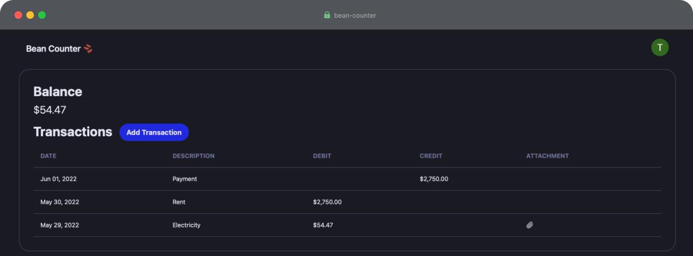

# Bean Counter 🫘

## Overview

Bean Counter is a simple web app that keeps track of transactions. Among its features include:

- 🔐 User authentication through Single Sign-on
- 💾 Creating and listing transactions via a database
- 🗄 Attachment storage in Google Cloud

## High-level system overview

The system uses the following technologies:
- Vercel, a Next.js hosting provider
- Next.js, a React app framework
	- Next.js uses React for the front-end
	- Next.js makes it easy to import other modules and services for the back-end
- NextAuth.js for authentication services
	- Google OAuth is the authentication provider
- Prisma for Object-Relational Mapping (ORM)
	- ORM abstracts interactions with the database
- PlanetScale, a server-less, widely available database
- Google Cloud Storage for attachment file storage

## User journey

1. The user accesses the website and is asked to authenticate. 
   - NextAuth.js manages the Google OAuth requests and responses.
2. The user authenticates through Google, and NextAuth.js gets their email.
   - Prisma then checks if the user's email exists in the PlanetScale database.
     - If the user exists, they are granted a NextAuth.js session and redirected to the dashboard.
     - If the user does not exist, they are given an error and asked to try a different email.
   - NB: There is no sign-up process. The user emails must be manually added to the database.
3. The authenticated user accesses the dashboard, which lists their transactions and balance.
   - Transactions are pulled from the database by the user's ID.
   - The balance is calculated by summing the transaction amounts and types (credit/debit).
   - Transactions with attachments include a link to Google Cloud Storage.
4. The user can create transactions.
   - They can set the amount, date, type, as well as add attachments.
   - Attachments are added to Google Cloud Storage, and the filename is added to the database.
5. The user logs out.
   - The NextAuth.js session is destroyed, and the user returns to the homepage.

## Data model 

TODO

## Installation

TODO

## Future plans

For future plans, see the project's [issue tracker](https://github.com/tycol7/bean-counter/issues).